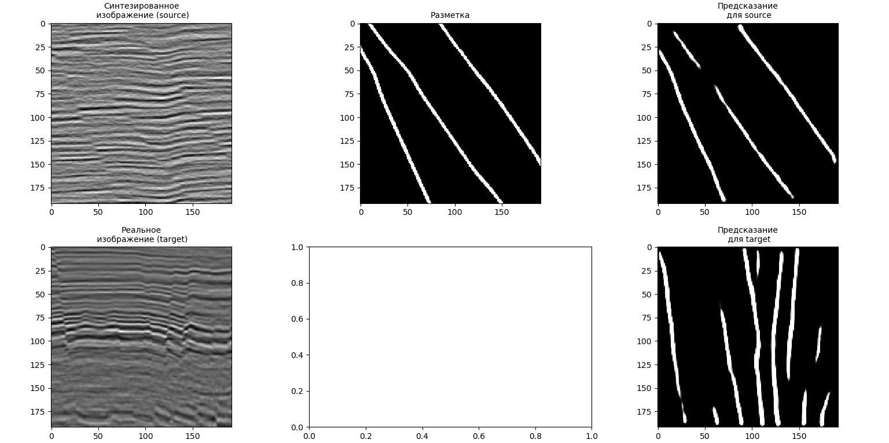
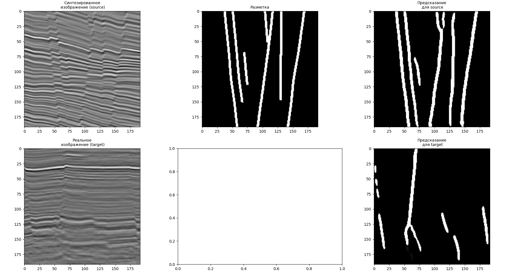

# Задача Domain Adaptation for Segmentation

В данном проекте представлен один из вариантов решения задачи адаптации домена (domian adaptation).
Суть этой адаптации заключается в обучении модели на данных из домена-источника (source domain) так,
чтобы она показывала сравнимое качество на целевом домене (target domain).
Например, source domain может представлять собой синтетические данные,
которые можно сгенерировать в необходимом количестве, а target domain — ограниченные реальные данные. 

В данном проекте представлено решение задачи сегментации некоторых искажений на изображениях с помощью сверточной нейронной сети (U-net).
Адаптация домена производилась двумя способами - минимизация энтропии и соревновательное обучение
(подробности и теоретическое описание данных подходов представлены в статье:
Vu T. H. et al. Advent: Adversarial entropy minimization for domain adaptation in semantic segmentation //Proceedings of the IEEE conference on computer vision and pattern recognition. – 2019. – С. 2517-2526.)

# Описание файлов и порядок запуска:

### 1. generator.py
На вход подается набор данных x_source, y_source, x_target в формате hdf5. 
В данном файле представлен класс ParallelArrayReaderThread для удобства чтения из выбранного формата.

### 2. train.py
Для обучения нейросети с минимизацией энтропии использовать функцию train_min_entropy().
Для обучения нейросети с применением соревноватльного обучения использовать функцию train_advent()

### 3. predict.py
Визуализация данных, разметки и предсказаний.

# Примеры результатов
#### а) Минимизация энтропии: 

#### б) Соревновательное обучение: 

